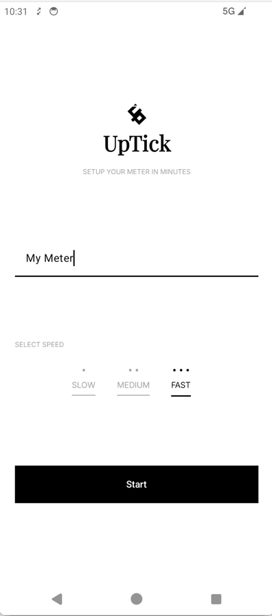
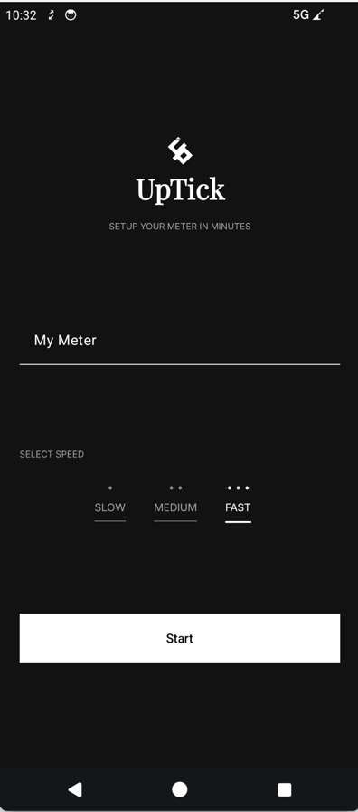

# UpTick


UpTick is a modern **meter application** built with **Kotlin Multiplatform (KMP)** and **Compose Multiplatform (CMP)**.

The project demonstrates a **modular architecture**, **shared business logic**, and **cross-platform UI development** using modern Kotlin technologies.

---

# 📱 Screenshots

### Light Theme


### Dark Theme


---

# Features

- Increment meter value
- Reset meter
- Smooth Compose Multiplatform UI
- Light / Dark theme support
- Modular architecture
- Shared business logic across platforms

---

# 🏗 Architecture

The project follows a **modular clean architecture** approach.

```

shared
├── components
├── navigation
├── designsystem
├── domain
feature
├── home
├── meter
│ ├── domain
│ └── presentation


```

Architecture layers:

- **Presentation** → UI and state management
- **Design System** → reusable UI components
- **Navigation** → shared navigation structure

---

# 🧰 Tech Stack

- Kotlin Multiplatform
- Compose Multiplatform
- Kotlin Coroutines
- Gradle Kotlin DSL
- Modular Architecture
- Material3 Design

---

# 📦 Project Structure

```

UpTick
├── androidApp
├── iosApp
├── shared
│ ├── designsystem
│ ├── components
│ ├── system
├── navigation
├── feature
│ ├── home
│ └── meter

```

---

# Getting Started

### Requirements

- Android Studio (latest)
- Kotlin Multiplatform plugin
- Xcode (for iOS build)

### Clone the repository


Clone the repository:

```
git clone https://github.com/oguzhandurmaz/uptick-kmp-meter.git
```

Open with **Android Studio (KMP supported version)**.

Run:

```
androidApp
```

or

```
iosApp
```

# 📄 License

This project is licensed under the **MIT License**.